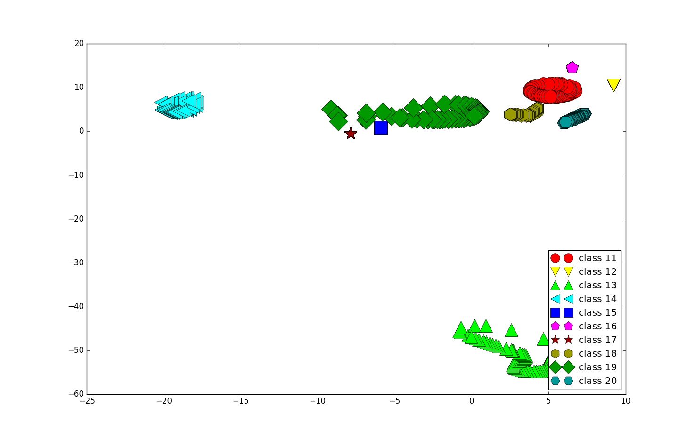

Python implementation of Elastic Embedding described in

    "The elastic embedding algorithm for dimensionality reduction."
    Carreira-Perpiñán, M. Á. ICML 2010.
and

    "Partial-Hessian strategies for fast learning of nonlinear embeddings"
    Vladymyrov, M. and Carreira-Perpiñán, M. Á. ICML 2012.

